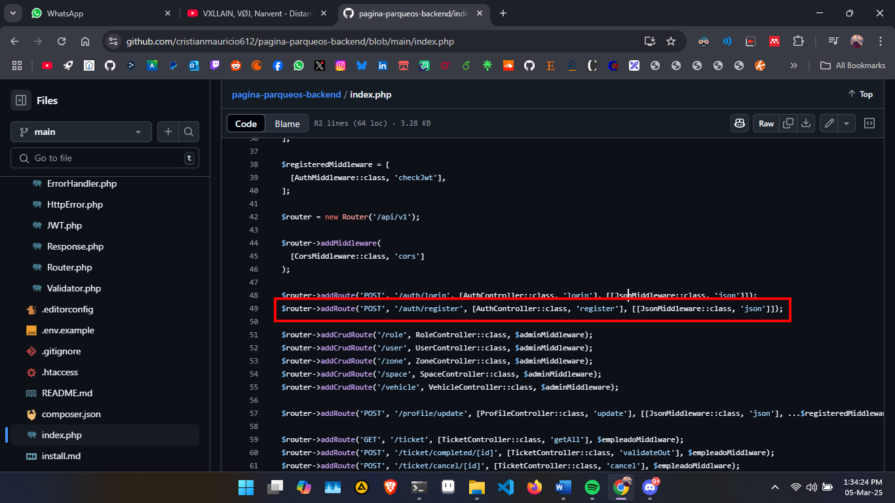
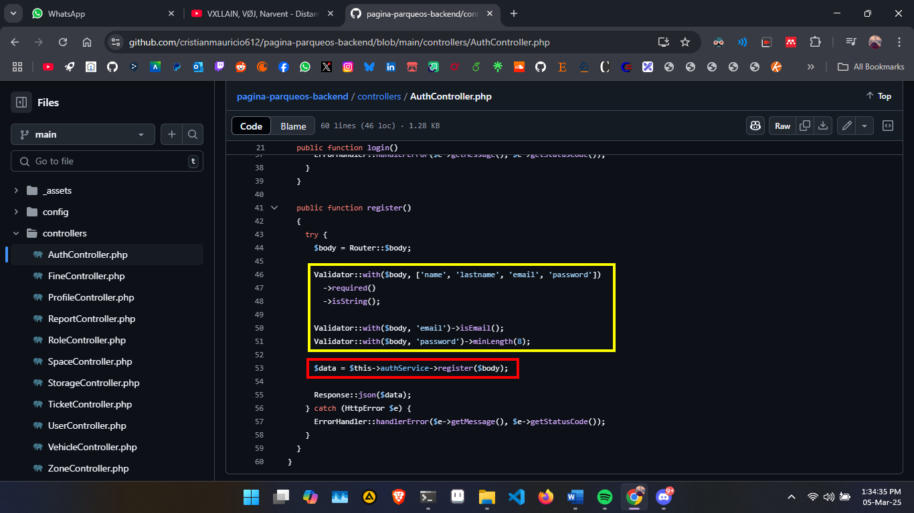
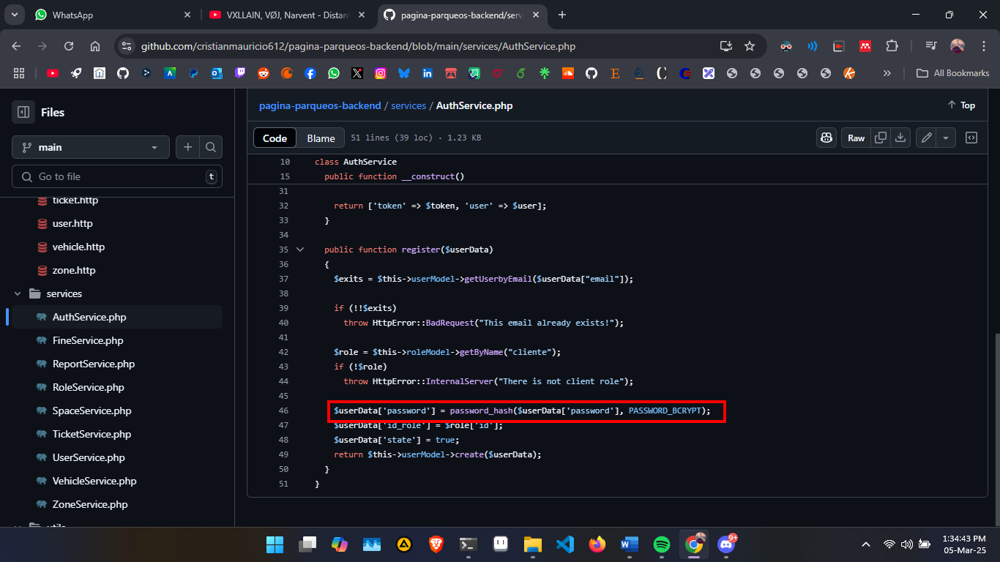
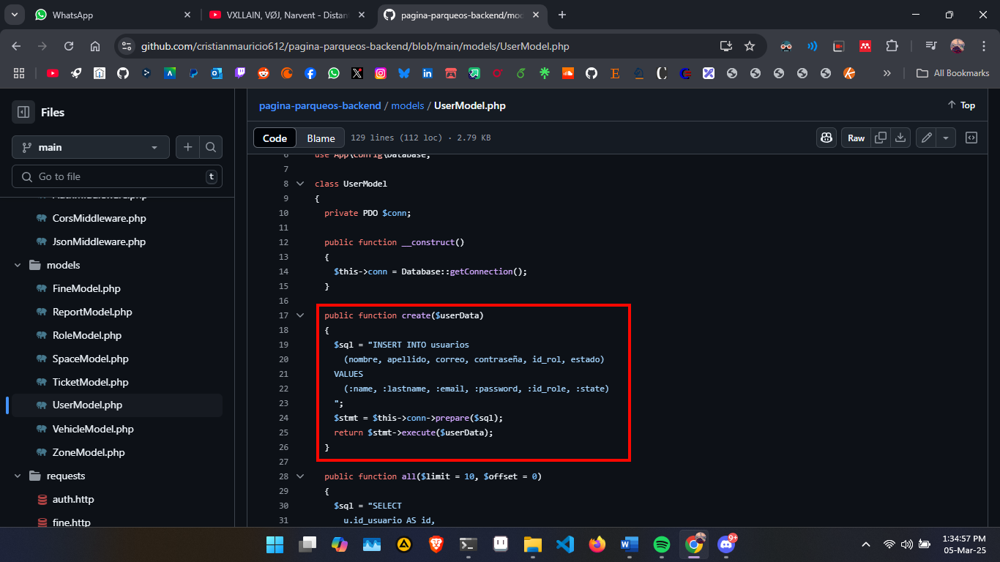
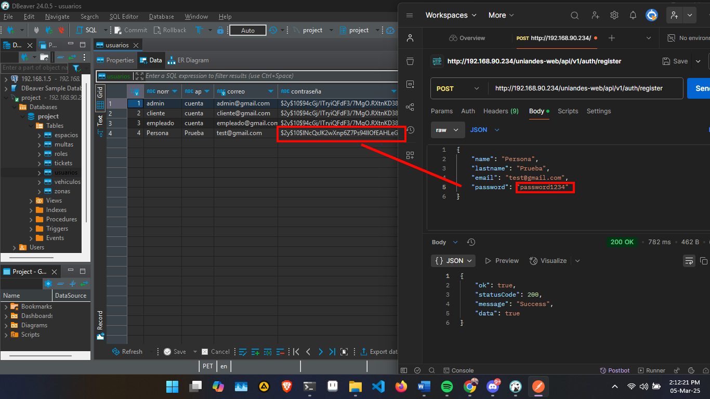

# 1. Captura de la petición

El Router captura la ruta `/auth/register` y la despacha con la clase `AuthController` con el método `register`.

- El `JsonMiddleware` es para validar el json que se envia al servidor desde el body. Este valida tanto el body como el `header` `Content-Type: application/json`.

# 2. Validación

`AuthController` valida los datos enviados y utiliza el servicio a `AuthService`.

# 3. Encriptación

`Auth Service` Verifica si el email enviado no está en uso encripta el campo de `password` con el algoritmo `bcrypt` incorporado en php. Posteriormente se envian los datos a MySql usando `UserModel` con el método create.

# Guardar en la base de datos.

Usamos el método `prepare` para evitar SQL Injection y enviamos los datos filtrados, validados y con la contraseña encriptada.

# Verificación

Al hacer un consulta a la API se puede evidenciar la contraseña encriptada en MySql.

