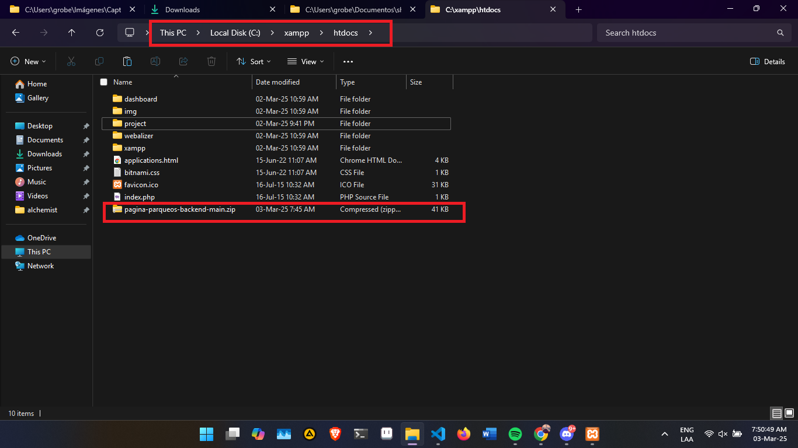

# Install

## 1. Descargar el Proyecto Como ZIP

## 2. Descargar e installar Xampp

## 3. Descargar e installar Composer

## 4. Copiar el proyecto en la carpeta `htdocs`

Path: `C:\xampp\htdocs`

## 5. Extraer el proyecto y ponerle un ejemplo

Ejemplo: `C:\xampp\htdocs\backend`

## 6. Verificar el contenido de la carpeta

## 7. Copiar el archivo `.env.example` y nombrarlo `.env`

## 8. Configurar `.env`

PATH: poner el nombre del proyecto`/backend`

## 9. Crear una carpeta para las imagenes

La carpeta puede ser en cualquier lugar y con cualquier nombre.

Ejemplo: `C:\Users\%USERNAME%\Escritorio\imagenes`

## 10. Crear una carpeta `fine` dentro

## 11. Agregar la primera carpeta en `PATH_STORAGE`

Reemplazar los `\` por `/`.

Inicio: `C:\Users\%USERNAME%\Escritorio\imagenes`
 
Fin: `C:/Users/%USERNAME%/Escritorio/imagenes`

## 12. Iniciar Xampp con Apache y Mysql

## 13. Copiar el sql del archivo `README.md` del repositorio.

url: <a href="https://github.com/cristianmauricio612/pagina-parqueos-backend/blob/main/README.md">`https://github.com/cristianmauricio612/pagina-parqueos-backend/blob/main/README.md`</a>

## 14. Crear la base de datos en phpmyadmin

<a href="http://localhost/phpmyadmin">PhpMyAdmin</a>

- El nombre de la base de datos tiene que ser el mismo que el de `.env`.

## 15. Copiar SQL

Copiar el SQL y ejectuar todo el código en la base de datos.

## 16. Abrir terminal en el proyecto

Abrir la terminal en el proyecto backend.

## 17. Iniciar el comando de composer

Comando: `composer install`

## 18. Agregar Roles en la base de datos.

## 19. Verficación rápida

- Copiar una imagen en la caperta de images dentro de la carpeta fine. Ejemplo `test.jpg`
- Buscar la imagen en el navegador
- Ejemplo: http://localhost/backend/api/v1/storage/fine/test.jpg

